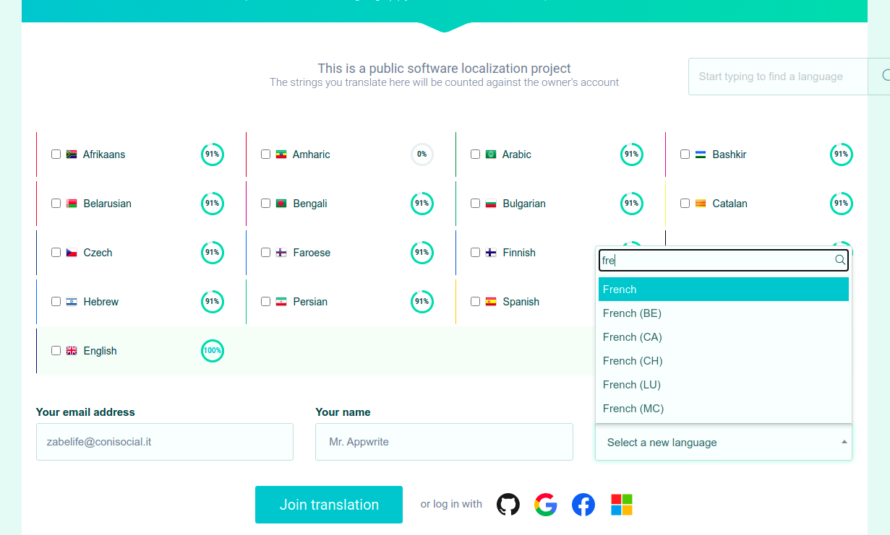
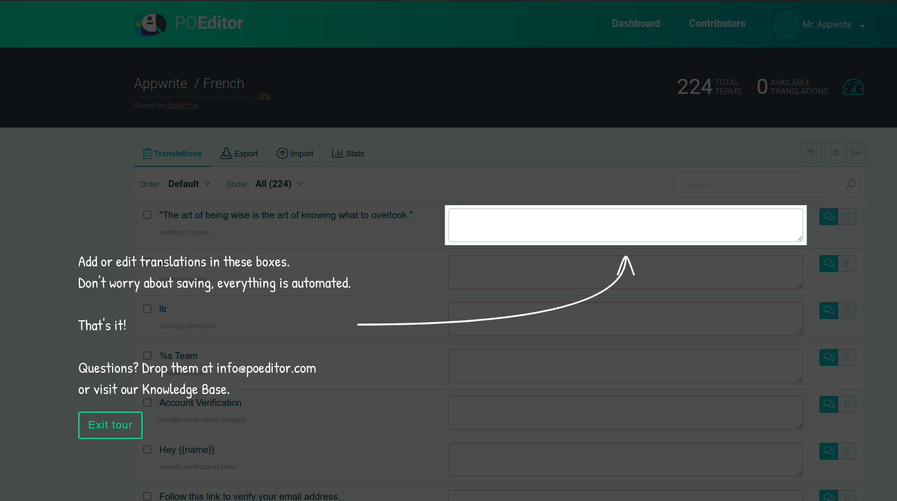
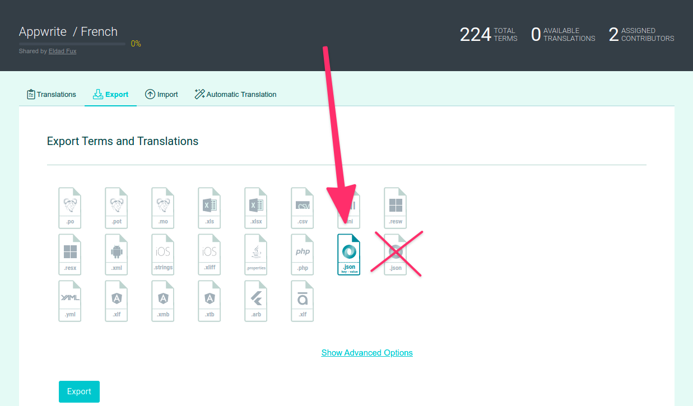
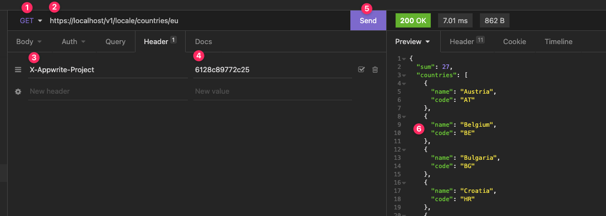
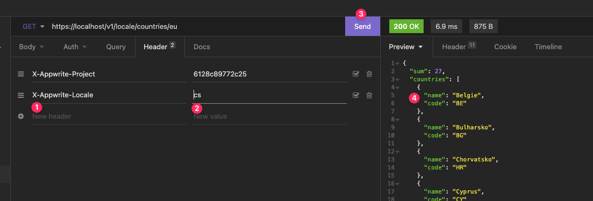

# Help translate Appwrite to your language ✍️

This document is part of the Appwrite contributors' guide. Before you continue reading this document make sure you have read the [Code of Conduct](https://github.com/appwrite/appwrite/blob/master/CODE_OF_CONDUCT.md) and the [Contributing Guide](https://github.com/appwrite/appwrite/blob/master/CONTRIBUTING.md).

## Getting started

Appwrite's Locale API, Email Templates ( and soon our Dashboard ) has support for returning responses in your own locale based on the value of the `X-Appwrite-Locale` header. Behind the scenes, we use the value of this header to find the correct translation file for the locale. This guide will walk you through the process of adding a new Locale to Appwrite. 

You can help in three distinct ways:
* Adding support for new locales
* Helping us with existing incomplete translations
* Reviewing existing translations for correctness


## 1. Prerequisites

It's really easy to contribute to an open-sourced project, but when using GitHub, there are a few steps we need to follow. This section will take you step-by-step through the process of preparing your own local version of Appwrite, where you can make any changes without affecting Appwrite right away.

> If you are experienced with GitHub or have made a pull request before, you can skip to [Generate the translations](#2-generate-the-translations).

###  1.1 Fork the Appwrite repository

Before making any changes, you will need to fork Appwrite's repository to keep branches on the official repo clean. To do that, visit the [Appwrite Github repository](https://github.com/appwrite/appwrite) and click on the fork button.


This will redirect you from `github.com/appwrite/appwrite` to `github.com/YOUR_USERNAME/appwrite`, meaning all changes you do are only done inside your repository. Once you are there, click the highlighted `Code` button, copy the URL and clone the repository to your computer using `git clone` command:

```shell
$ git clone COPIED_URL
```

> To fork a repository, you will need a basic understanding of CLI and git-cli binaries installed. If you are a beginner, we recommend you to use `Github Desktop`. It is a really clean and simple visual Git client.

Finally, you will need to create a `feat-XXX-YYY-translation` branch based on the `locale` branch and switch to it. The `XXX` should represent issue ID and `YYY` the language name.


## 2. Generate the translations

You can choose to contribute either directly on [**GitHub**](#21-manually-using-github) or using [**POEditor**](#22-visually-using-po-editor) if you prefer a GUI.

### 2.1 Manually using GitHub
 
> Proceed to [Visually using PO Editor](#22-visually-using-po-editor) if you want to use graphical interface instead.


We maintain a [`locale branch`](https://github.com/appwrite/appwrite/tree/locale/) under the [appwrite/appwrite repo](https://github.com/appwrite/appwrite/) exclusively for translations related PRs. Here are a few files that you need to refer to help with your contribution.

1. **terms.json**

    [terms.json](https://github.com/appwrite/appwrite/blob/locale/app/config/locale/terms.json) contains all the terms that are used in Appwrite that require translation. Each term is a JSON object as shown below.

    ```json
    [
        {
            "term": "settings.inspire",
            "comment": "This string is used as an easter egg in the appwrite.io source code.",
            "reference": ""
        }
    ]
    ```

2. **en.json**

    [en.json]((https://github.com/appwrite/appwrite/blob/locale/app/config/locale/translations/en.json)) contains the English translation for all the terms that are present in **terms.json**. You can use this file as a reference when making a contribution for your language.

    ```json
    {
        "settings.inspire": "\"The art of being wise is the art of knowing what to overlook.\"",
        "settings.locale": "en",
        "settings.direction": "ltr",
        "emails.sender": "%s Team",
        ....
        ....
    }
    ```

3. **languages.php**

    [languages.php](https://github.com/appwrite/appwrite/blob/locale/app/config/locale/languages.php) contains all the languages listed in **[ISO 639-1](https://en.wikipedia.org/wiki/List_of_ISO_639-1_codes)**. You can use this file to find your language code when making a contribution for your language. 

Great, let's start. First, find the code of the language you want to add. For example, if you want to add support for **Spanish**, you can find the code for Spanish in [languages.php](https://github.com/appwrite/appwrite/blob/locale/app/config/locale/languages.php#L202).

Once you have found the ISO language code for **Spanish** (es), create a new file `/app/config/locale/translations/es.json` just like all [the other languages](https://github.com/appwrite/appwrite/tree/locale/app/config/locale/translations). 

Next, choose a reference language. If English is your reference language, copy the contents of [`en.json`](https://github.com/appwrite/appwrite/blob/locale/app/config/locale/translations/en.json) into `/app/config/locale/translations/es.json` and translate all the corresponding strings like so 

```json
{
    "settings.inspire": "\"El arte de ser sabio es el arte de saber qué pasar por alto\"",
    "settings.locale": "es",
    "settings.direction": "ltr",
    "emails.sender": "Equipo %s"
    ... ...
}
```

### 2.2 Visually using PO Editor

> Proceed to [Add the translations to the project](#3-add-the-translations-to-the-project) if you already followed the GitHub approach.

We use [PO Editor](https://poeditor.com/) to manage all our translations in a convenient way. The first step is to join the Appwrite Project on PO Editor using [our invite link](https://poeditor.com/join/project?hash=BNrWbRXyk6). 

On the home page, you can see all the languages that we currently support and the progress in each one. You can choose to be help us complete the existing translations or add new ones.



Once you've chosen the languages you want to contribute to, click on **Join Translation** with your email ID and name or choose one of the OAuth providers.

Continue with the rest of the process until you arrive at your dashboard.


Your request might be pending, so you can ping us on Discord and we'll make the process faster 😀 . Once your request has been accepted, you can proceed.



You're now ready to start contributing. On the left, you'll find the string to be translated in the default reference language ( which is English ). You can also change the default language to something that you're more familiar with using the toggle. 


Once you're happy with your translations, you can export them. Head over to the **Exports** tab and choose the **Key-Value JSON** option only. Download the file and you can then follow the steps similar to the Github approach.



> **Attention! 🛑** There are two JSON exports. Please make sure to export the one saying `Key-value JSON`. Refer to the screenshot if you are not sure which one is correct.

After exporting a JSON file, we need to rename it to follow the **[ISO 639-1](https://en.wikipedia.org/wiki/List_of_ISO_639-1_codes)** standards. You can use [languages.php](https://github.com/appwrite/appwrite/blob/locale/app/config/locale/languages.php) file to find your language code when making a contribution for your language. For example, Spanish translation should have file called `es.json`.


## 3. Add the translations to the project

Add your language code to [codes.php](https://github.com/appwrite/appwrite/blob/locale/app/config/locale/codes.php#L14) in the following format.
```php
    ...
    'es', // Spanish
    ...
```

Finally, load your translation file in `init.php` by following a pattern similar to the [existing languages](https://github.com/appwrite/appwrite/blob/locale/app/init.php#L270).

>  Please make sure to keep both `codes.php` and `init.php` in the alphabetical order A-Z.

## 4. Test the translations

To test if the translation is properly loaded, we will send a GET request to get a list of EU countries.

First of all, we need to start a local instance of Appwrite. Thanks to Docker, this can be done using one command.

```shell
$ docker-compose up -d
```

If this is your first time running Appwrite, it may take up to few minutes to download all images and start all containers. Once everything is started, you should see Appwrite running on `http://localhost:80`. When you visit this URL, it will ask you to sign up. After that, it will show you your empty dashboard where you need to create a new project - give it any name you want. Then you need to go to `Settings` of the project and copy `Project-ID`.

If you are lost in the Appwrite dashboard, check out our [Article about Appwrite's dashboard](https://dev.to/appwrite/30daysofappwrite-appwrite-dashboard-15cc).


Now, let's send the request. We will be editing headers of the request, so you will need a tool to do that, such as Postman or Insomnia.

First, let's see English translations. Let's set request type to `GET`, URL to `https://localhost/v1/locale/countries/eu` and add `X-Appwrite-Project` header.



> Make sure to use your own project ID for the header.

After firing the request, we can see countries named `Austria, Belgium, Bulgaria...` So far, we are getting English translations of the country names.

Once we add `X-Appwrite-Locale` header and send the request again, we will get the names in a specific language.



> Make sure to replace the locale code with the language code you are writing translations for.

If you can see countries names translated, everything works, and you are ready for the last step. 😊

## 5. Raise a pull request

First of all, commit the changes with the message `Added YYY translations` where `YYY` is the translated language and push it. This will publish a new branch to your forked version of Appwrite. If you visit it at `github.com/YOUR_USERNAME/appwrite`, you will see a new alert saying you are ready to submit a pull request. Follow the steps GitHub provides, and at the end, you will have your pull request submitted.

## 🤕 Stuck ?
If you need any help with the contribution, feel free to head over to [our discord channel](https://appwrite.io/discord) and we'll be happy to help you out.
